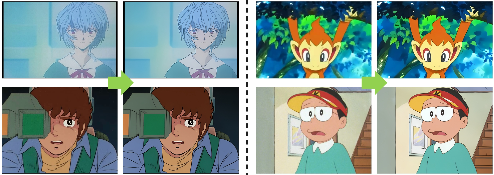

# APISR (CVPR 2024)
 📖 APISR: Anime Production Inspired Real-World Anime Super-Resolution\
 APISR aims at restoring and enhancing low-quality anime images with various degradations from real-world scenarios. \
👀[**Visualization**](#Visualization)  **|** 🔥 [Update](#Update) **|** 🔧 [Installation](#installation) **|** ⚡[Inference](#inference) **|** 🧩 [Dataset Curation](#dataset_curation) **|** 💻 [Train](#train)

> [](https://arxiv.org/abs/2403.01598)<br>
:star: If you like APISR, please help star this repo. Thanks! :hugs:


<!---------------------------------------- Visualization ---------------------------------------->
## <a name="Visualization"></a> Visualization (Zoom in for the best view!) 👀

<p align="center">
  
</p>

<p align="center">
  
</p>
<!--------------------------------------------  --------------------------------------------------->


## <a name="Update"></a>Update 🔥🔥🔥
- [x] Release Paper version implementation of APISR 
- [ ] Release a version of weight (for 2x, 4x and more) that is more emphasized on user visual preference instead of metrics
- [ ] Gradio demo (maybe online)


## <a name="installation"></a> Installation 🔧

```shell
git clone git@github.com:Kiteretsu77/APISR.git
cd APISR

# Create conda env
conda create -n APISR python=3.10
conda activate APISR

# Install Pytorch we use torch.compile in our repository by default
pip install torch==2.1.1 torchvision==0.16.1 torchaudio==2.1.1 --index-url https://download.pytorch.org/whl/cu118
pip install -r requirements.txt

# Install FFMPEG (the following is for linux system, the rest can see https://ffmpeg.org/download.html)
sudo apt install ffmpeg
```


## <a name="inference"></a> Inference ⚡⚡⚡
1. Download the weight from https://drive.google.com/file/d/1Ubj-1f7gmi-dWlK_aUVcScZAlzKtuBJ8/view?usp=sharing and put it to "pretrained" folder
2. Then, Execute 
    ```shell
    python test_code/inference.py --input_dir XXX  --weight_path XXX  --store_dir XXX
    ```
    The default argument of test_code/inference.py is capable to execute sample images from "__assets__" folder


## <a name="dataset_curation"></a> Dataset Curation 🧩
1. All the dataset curation pipeline is under "dataset_curation_pipeline" folder. You can collect your own dataset by sending videos into the pipeline and get least compressed and the most informative images from the video sources. With a folder with video sources, you can execute the following to get a basic dataset:

    ```shell
    python dataset_curation_pipeline/collect.py --video_folder_dir XXXX --save_dir XXX
    ```

## <a name="train"></a> Train (TBD) 💻
1. Prepare a dataset (AVC/API)

2. Train: Please check **opt.py** to setup parameters you want (We use opt.py to control everything we want)\
    **Step1** (Net L1 loss training): Run 
    ```shell
    python train_code/train.py 
    ```
    The model weights will be inside the folder 'saved_models'

    **Step2** (GAN Adversarial Training): 
    1. Change opt['architecture'] in **opt.py** as "GRLGAN".
    2. Rename weights in 'saved_models' (either closest or the best, we use closest weight) to **grlgan_pretrained.pth**
    3. Run 
    ```shell
    python train_code/train.py --use_pretrained
    ```

## Related Projects
1. Fast Anime SR acceleration: https://github.com/Kiteretsu77/FAST_Anime_VSR 
2. My previous paper (VCISR - WACV2024) as the baseline method: https://github.com/Kiteretsu77/VCISR-official 


## Citation
Please cite us if our work is useful for your research.

## Disclaimer
This project is released for academic use only. We disclaim responsibility for the distribution of the dataset. Users are solely liable for their actions. 
The project contributors are not legally affiliated with, nor accountable for, users' behaviors.


## License
This project is released under the [GPL 3.0 license](LICENSE).

## Contact
If you have any questions, please feel free to contact me at hikaridawn412316@gmail.com or boyangwa@umich.edu.

